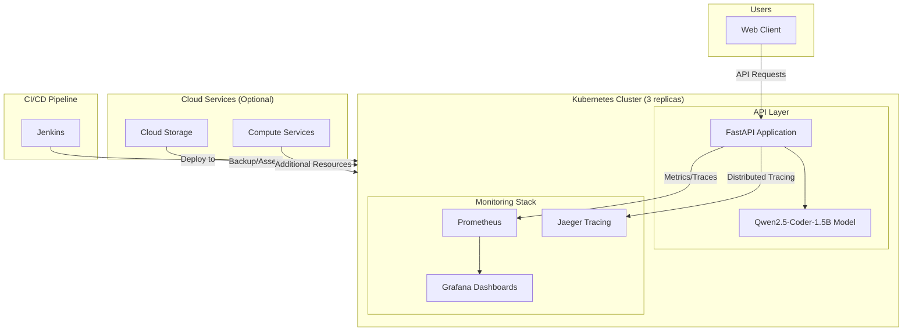
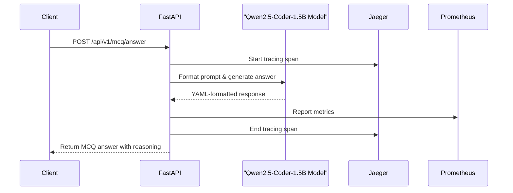
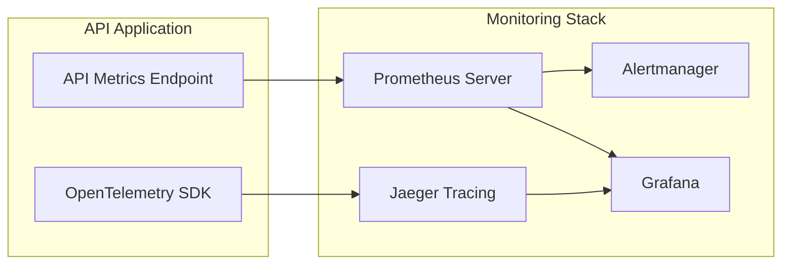
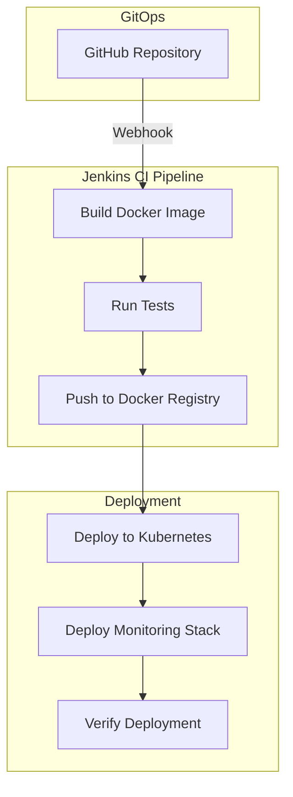
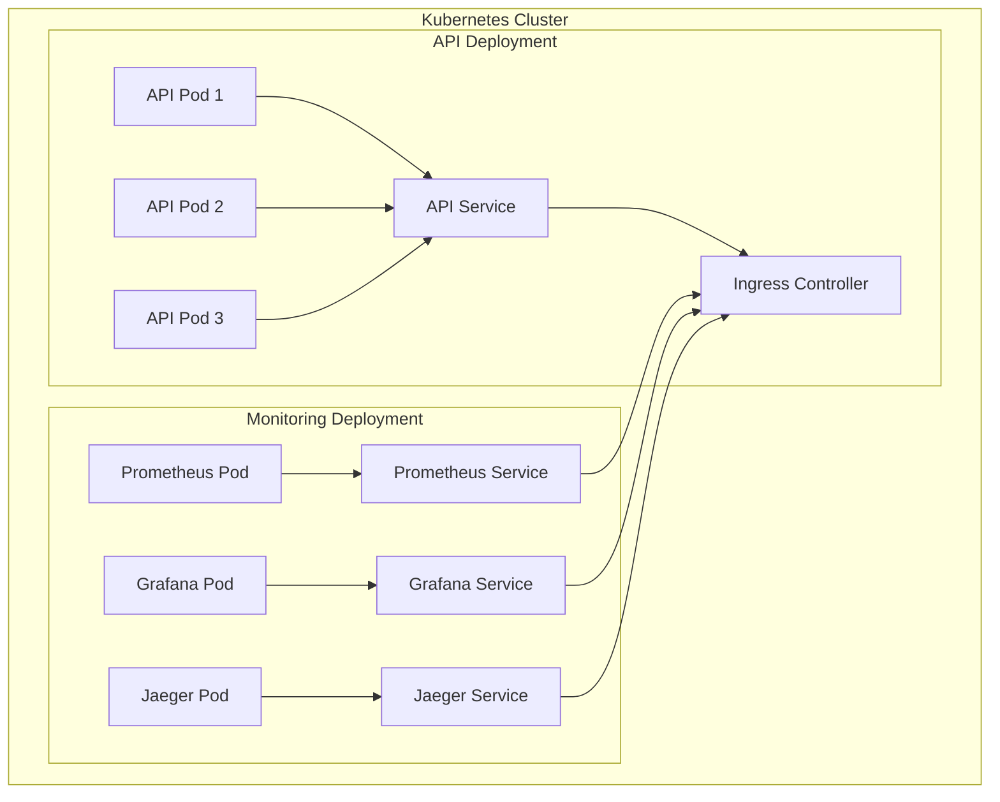
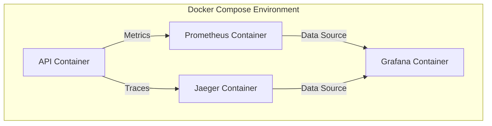
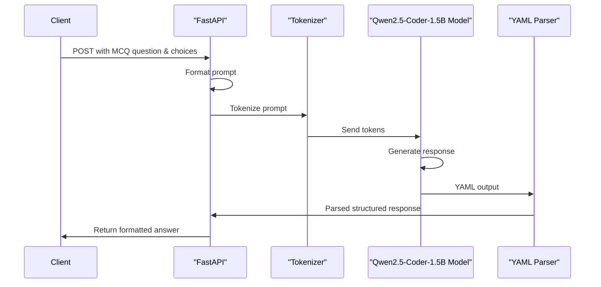

# System Architecture Diagrams

## Overall System Architecture

## API Service Flow

## Monitoring Stack

## CI/CD Pipeline

## Kubernetes Deployment

## Docker Compose Development Environment

## Model Inference Flow

