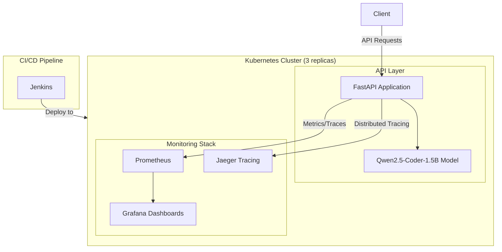

# Qwen-Coder-MCQ Platform

<div align="center">
  
  
  
  
  
  
  
  
</div>

## 📑 Table of Contents

- [Qwen-Coder-MCQ Platform](#qwen-coder-mcq-platform)
  - [📑 Table of Contents](#-table-of-contents)
  - [Overview](#overview)
  - [Key Features](#key-features)
  - [System Architecture](#system-architecture)
  - [Installation and Setup](#installation-and-setup)
    - [Prerequisites](#prerequisites)
    - [Local Development](#local-development)
    - [Docker Compose](#docker-compose)
    - [Kubernetes Deployment](#kubernetes-deployment)
  - [Usage Guide](#usage-guide)
    - [API Endpoints](#api-endpoints)
    - [Request/Response Format](#requestresponse-format)
    - [Example Queries](#example-queries)
  - [Monitoring Setup](#monitoring-setup)
    - [Prometheus](#prometheus)
    - [Grafana](#grafana)
    - [Jaeger Tracing](#jaeger-tracing)
  - [CI/CD Pipeline](#cicd-pipeline)
  - [Cloud Integration](#cloud-integration)
  - [Performance Benchmarks](#performance-benchmarks)
  - [Contributing](#contributing)
  - [License](#license)

## Overview

This project extends the Qwen2.5-Coder-1.5B-Instruct model into a production-ready API platform for answering multiple-choice coding questions with step-by-step reasoning. It combines a powerful LLM specialized in coding tasks with robust infrastructure components including containerization, monitoring, distributed tracing, and Kubernetes orchestration.

The system provides a RESTful API that accepts coding multiple-choice questions and returns structured YAML-formatted responses with detailed reasoning steps, making it ideal for educational tools, programming assessments, and learning platforms.

## Key Features

- **Production-Ready API**: FastAPI-based REST interface with both streaming and non-streaming responses
- **Structured Reasoning**: YAML-formatted outputs with understanding, analysis, reasoning, and conclusion steps
- **Containerization**: Complete Docker setup with Docker Compose for local development
- **Kubernetes Deployment**: Full K8s configuration with 3 replicas for high availability
- **Comprehensive Monitoring**:
  - Prometheus metrics collection
  - Grafana dashboards for system and API performance visualization
  - Jaeger distributed tracing with OpenTelemetry integration
- **CI/CD Pipeline**: Jenkins configuration for automated testing and deployment
- **Cloud-Ready**: Optional integration with cloud storage and compute services
- **High Performance**: Optimized for GPU inference with memory-efficient setup
- **Developer-Friendly**: Detailed documentation and examples

## System Architecture


The platform follows a microservices architecture with the following components:



For more detailed diagrams, see [DIAGRAMS.md](DIAGRAMS.md).

## Installation and Setup

### Prerequisites

- Python 3.10+
- Docker and Docker Compose
- Kubernetes cluster (for production deployment)
- NVIDIA GPU with CUDA support (recommended)
- Helm (for Kubernetes deployments)

### Local Development

1. Clone the repository:
```bash
git clone https://github.com/your-username/qwen-coder-mcq-platform.git
cd qwen-coder-mcq-platform
```

2. Install dependencies:
```bash
pip install -r requirements.txt
```

3. Run the development server:
```bash
cd app
python main.py
```

The API will be available at http://localhost:8000

### Docker Compose

For a complete local environment with monitoring:

```bash
# Build and start all services
docker-compose up -d

# View logs
docker-compose logs -f api

# Stop all services
docker-compose down
```

Services will be available at:
- API: http://localhost:8000
- Prometheus: http://localhost:9090
- Grafana: http://localhost:3000 (username: admin, password: admin)
- Jaeger UI: http://localhost:16686

### Kubernetes Deployment

1. Update Kubernetes configuration files in `kubernetes/` directory with your specific settings

2. Deploy to Kubernetes:
```bash
# Create namespace
kubectl create namespace qwen-api

# Apply configuration
kubectl apply -f kubernetes/api-deployment.yaml -n qwen-api
kubectl apply -f kubernetes/api-service.yaml -n qwen-api
kubectl apply -f kubernetes/api-ingress.yaml -n qwen-api

# Deploy monitoring stack with Helm
helm repo add prometheus-community https://prometheus-community.github.io/helm-charts
helm repo add grafana https://grafana.github.io/helm-charts
helm repo update

helm install prometheus prometheus-community/prometheus -n qwen-api -f kubernetes/prometheus-values.yaml
helm install grafana grafana/grafana -n qwen-api -f kubernetes/grafana-values.yaml
helm install jaeger jaegertracing/jaeger -n qwen-api
```

3. Verify deployment:
```bash
kubectl get pods -n qwen-api
kubectl get services -n qwen-api
kubectl get ingress -n qwen-api
```

## Usage Guide

### API Endpoints

| Endpoint | Method | Description |
|----------|--------|-------------|
| `/api/v1/health` | GET | Health check endpoint |
| `/api/v1/mcq/answer` | POST | Get answer for MCQ with reasoning (non-streaming) |
| `/api/v1/mcq/explain` | POST | Get answer with optional streaming support |
| `/metrics` | GET | Prometheus metrics endpoint |

### Request/Response Format

**Request:**

```json
{
  "question": "What does the SQL function 'ROUND()' do?",
  "choices": {
    "A": "Rounds a number to the nearest integer",
    "B": "Concatenates two or more strings",
    "C": "Converts a string to lowercase",
    "D": "Returns the length of a string"
  },
  "streaming": false,
  "max_length": 2048
}
```

**Response:**

```json
{
  "understanding": "The question is asking about the purpose and functionality of the SQL ROUND() function.",
  "analysis": "A. Rounds a number to the nearest integer - This option states that ROUND() is used for numerical rounding operations.\nB. Concatenates two or more strings - This describes string concatenation, which is typically done with operators like + or || or the CONCAT() function.\nC. Converts a string to lowercase - This describes the LOWER() function.\nD. Returns the length of a string - This describes the LENGTH() function.",
  "reasoning": "The ROUND() function in SQL is specifically designed for rounding numeric values. It takes a number and rounds it to a specified number of decimal places, or to the nearest integer if no decimal place is specified.",
  "conclusion": "Based on the options provided, A is the correct answer because ROUND() indeed rounds a number to the nearest integer (or to a specified number of decimal places).",
  "answer": "A"
}
```

### Example Queries

**cURL:**

```bash
curl -X POST "http://localhost:8000/api/v1/mcq/answer" \
     -H "Content-Type: application/json" \
     -d '{
       "question": "What does the SQL function \"ROUND()\" do?",
       "choices": {
         "A": "Rounds a number to the nearest integer",
         "B": "Concatenates two or more strings",
         "C": "Converts a string to lowercase",
         "D": "Returns the length of a string"
       }
     }'
```

**Python:**

```python
import requests

api_url = "http://localhost:8000/api/v1/mcq/answer"
payload = {
    "question": "What does the SQL function 'ROUND()' do?",
    "choices": {
        "A": "Rounds a number to the nearest integer",
        "B": "Concatenates two or more strings",
        "C": "Converts a string to lowercase",
        "D": "Returns the length of a string"
    }
}

response = requests.post(api_url, json=payload)
result = response.json()
print(f"Answer: {result['answer']}")
print(f"Reasoning: {result['reasoning']}")
```

## Monitoring Setup

### Prometheus

Prometheus is configured to scrape metrics from the API service and system components. Key metrics include:

- API latency by endpoint
- Request counts and error rates
- Memory and CPU usage
- Model inference time
- GPU utilization

The Prometheus configuration is located in `prometheus/prometheus.yml`.

### Grafana

Preconfigured Grafana dashboards are provided in the `grafana/dashboards` directory:

1. **API Performance Dashboard**: Request latency, throughput, and error rates
2. **System Resource Dashboard**: CPU, memory, disk, and GPU utilization
3. **Model Performance Dashboard**: Inference time and batch processing metrics

Access Grafana at http://localhost:3000 with default credentials (admin/admin).

### Jaeger Tracing

Distributed tracing is implemented using OpenTelemetry and Jaeger. Trace spans include:

- Request processing steps
- Model inference time
- External service calls

Access the Jaeger UI at http://localhost:16686 to visualize request flows and identify bottlenecks.

## CI/CD Pipeline

A Jenkins pipeline is configured to automate:

1. Building and testing the application
2. Creating Docker images
3. Deploying to Kubernetes
4. Setting up monitoring

See the `Jenkinsfile` for the complete pipeline configuration.

## Cloud Integration

The platform can optionally integrate with cloud services:

- **Storage**: Use cloud object storage for model weights and artifacts
- **Compute**: Leverage cloud GPUs for inference
- **Managed Kubernetes**: Deploy to managed K8s services like GKE, EKS, or AKS
- **Monitoring**: Integrate with cloud-native monitoring solutions

Configuration examples for major cloud providers are available in the `cloud/` directory.

## Performance Benchmarks

| Configuration | Avg. Latency | Throughput | Memory Usage |
|---------------|--------------|------------|--------------|
| CPU (4 cores) | 2.5s         | 1.6 req/s  | 4.5 GB       |
| T4 GPU        | 850ms        | 4.7 req/s  | 5.2 GB       |
| V100 GPU      | 320ms        | 12.5 req/s | 5.8 GB       |

For more detailed benchmarks, see [BENCHMARKS.md](BENCHMARKS.md).

## Contributing

Contributions are welcome! Please see [CONTRIBUTING.md](CONTRIBUTING.md) for guidelines.

1. Fork the repository
2. Create a feature branch: `git checkout -b feature/my-feature`
3. Commit changes: `git commit -am 'Add new feature'`
4. Push to branch: `git push origin feature/my-feature`
5. Submit a pull request

## License

This project is licensed under the MIT License - see the [LICENSE](LICENSE) file for details.